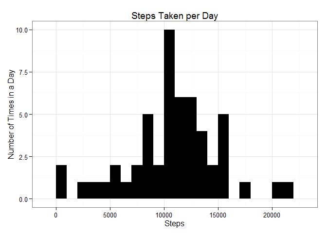
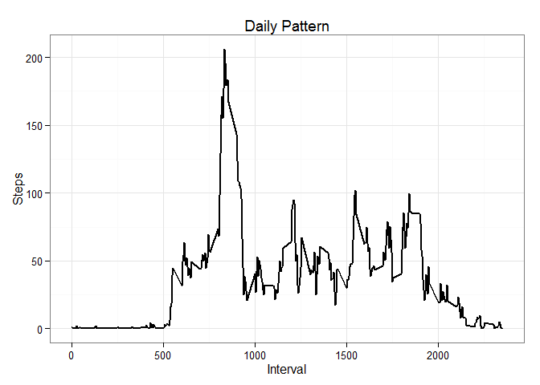
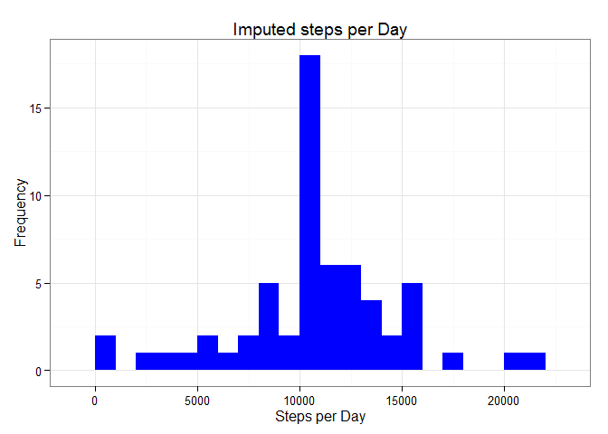
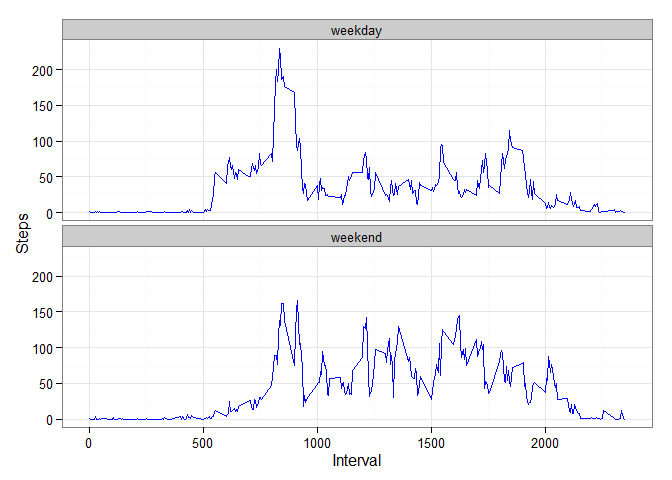

# Reproducible Research: Peer Assessment 1

# Prerequisites: 
## Libraries - loaded in code, install if necessary
- ggplot2
- knitr

## Loading and preprocessing the data
Loading the data from the provided (unzipped) zip file. The file must be in this working directory.


```r
library(ggplot2)
```

```
## Warning: package 'ggplot2' was built under R version 3.1.3
```

```r
library(knitr)
```

```
## Warning: package 'knitr' was built under R version 3.1.3
```

```r
##library(dplyr)
activity <- read.csv("activity.csv", header=TRUE)
```

Clean the data for analysis. Massaging "date" value into Date data type and "interval" from character into factor.

```r
## massage the date column into a Date value and the interval to a number (from character in the default inport)
activity$date <- as.Date(activity$date, format = "%Y-%m-%d")
activity$interval <- as.numeric(activity$interval)
```

## What is mean total number of steps taken per day?

1. Daily totals

```r
totals <- aggregate(steps ~ date, activity, sum)
```

2. Histogram of total steps per day

```r
ggplot(totals, aes(x = steps)) + 
       geom_histogram(fill = "black", binwidth = 1000) + 
        labs(title="Steps Taken per Day", 
             x = "Steps", y = "Number of Times in a Day") + theme_bw() 
```

 

3. Mean and median steps per day

```r
stepmean   <- mean(totals$steps, na.rm=TRUE)
stepmedian <- median(totals$steps, na.rm=TRUE)
```

Mean is 10766.19  
Median is 10765

## What is the average daily activity pattern?
1. Make a time series plot (i.e. type = "l") of the 5-minute interval (x-axis) and the average number of steps taken, averaged across all days (y-axis)


```r
intervals <- aggregate(activity$steps, by=list(interval = activity$interval), FUN=mean, na.rm=TRUE)
colnames(intervals) <- c("interval", "steps") # useful to keep naming conventions straight
ggplot(intervals, aes(x=interval, y=steps)) +   
        geom_line(color="black", size=1) +labs(title="Daily Pattern", x="Interval", y="Steps") +  theme_bw()
```

 

2. Which 5-minute interval, on average across all the days in the dataset, contains the maximum number of steps?


```r
maxinterval <- intervals[intervals$steps == max(intervals$steps),]$interval
```

Interval with highest average step count = 835


## Imputing missing values
Note that there are a number of days/intervals where there are missing values (coded as NA). The presence of missing days may introduce bias into some calculations or summaries of the data.

1. Calculate and report the total number of missing values in the dataset (i.e. the total number of rows with NAs)

```r
missing <- sum(is.na(activity$steps))
```

Total number of *missing step data* is 2304

2. Devise a strategy for filling in all of the missing values in the dataset. The strategy does not need to be sophisticated. For example, you could use the mean/median for that day, or the mean for that 5-minute interval, etc.

**My strategy will be to interpolate the average value for the interval into NA fields.**

3. Create a new dataset that is equal to the original dataset but with the missing data filled in.


```r
new_activity <- activity
for(v in 1:length(new_activity$steps))
{
  if(is.na(new_activity[v,]$steps))
  {
    new_activity[v,]$steps <- intervals[intervals$interval == new_activity[v,]$interval, ]$steps
  }
}
```

4. Make a histogram of the total number of steps taken each day and Calculate and report the mean and median total number of steps taken per day. Do these values differ from the estimates from the first part of the assignment? What is the impact of imputing missing data on the estimates of the total daily number of steps?


```r
new_totals <- aggregate(steps ~ date, new_activity, sum)
colnames(new_totals) <- c("date","steps")

ggplot(new_totals, aes(x = steps)) + 
  geom_histogram(fill = "blue", binwidth = 1000) + 
  labs(title="Steps per Day", 
       x = "Steps per Day", y = "Frequency") + theme_bw() 
```

 

```r
new_stepmean   <- mean(new_totals$steps, na.rm=TRUE)
new_stepmedian <- median(new_totals$steps, na.rm=TRUE)
```

Mean for original data is 10766.19  
Median for original data is 10765

Mean for revised data is 10766.19  
Median for revised data is 10766.19

The means are the same between the two datasets, logical since I am using mean values to fill in the NAs, while the median is slightly higher for the updated version; presumably because the number of samples used is higher in the median computation skewing the value to the greater number.

## Are there differences in activity patterns between weekdays and weekends?
For this part the weekdays() function may be of some help here. Use the dataset with the filled-in missing values for this part.

Create a new factor variable in the dataset with two levels - "weekday" and "weekend" indicating whether a given date is a weekday or weekend day.

```r
weekend_or_weekday <- function(data) {
    steps <- aggregate(data$steps, by=list(interval = data$interval),
                          FUN=mean, na.rm=T)
    colnames(steps) <- c("interval", "steps")
    steps
}

new_activity$weekday <- as.factor(weekdays(new_activity$date))

weekend_vals <- subset(new_activity, weekday %in% c("Saturday","Sunday"))
weekday_vals <- subset(new_activity, !weekday %in% c("Saturday","Sunday"))

weekend_steps <- weekend_or_weekday(weekend_vals)
weekday_steps <- weekend_or_weekday(weekday_vals)

weekend_steps$dayofweek <- rep("weekend", nrow(weekend_steps))
weekday_steps$dayofweek <- rep("weekday", nrow(weekday_steps))

all_days <- rbind(weekend_steps, weekday_steps)
all_days$dayofweek <- as.factor(all_days$dayofweek)
```

Make a panel plot containing a time series plot (i.e. type = "l") of the 5-minute interval (x-axis) and the average number of steps taken, averaged across all weekday days or weekend days (y-axis). See the README file in the GitHub repository to see an example of what this plot should look like using simulated data.


```r
ggplot(all_days, aes(x=interval, y=steps)) + 
  geom_line(color="blue") + 
  facet_wrap(~ dayofweek, nrow=2, ncol=1) +
  labs(x="Interval", y="Steps") +
  theme_bw()
```

 
